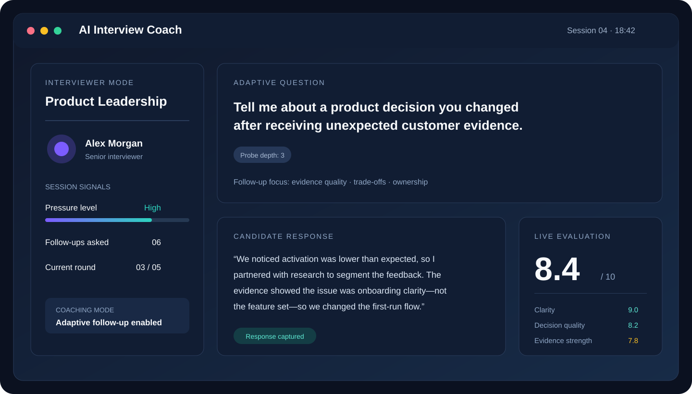
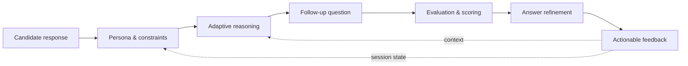

# AI Interview Coach

> **A prompt-engineered behavioral interview simulation system**
>
> **Resumes are static. Interviews are adversarial.**

<p align="center">
  
</p>

<p align="center">
  <strong>Adaptive questioning · Stateful conversations · Consistent evaluation</strong>
</p>

<p align="center">
  <a href="#how-it-works">How it works</a> ·
  <a href="#prompt-architecture">Prompt architecture</a> ·
  <a href="#use-cases">Use cases</a> ·
  <a href="#getting-started">Getting started</a>
</p>

## Overview

AI Interview Coach is a stateful interview simulation system built with layered prompt engineering. It is designed to replicate realistic interviewer behavior rather than produce a static question-and-answer flow.

The system adapts to candidate responses, introduces targeted follow-ups, increases cognitive pressure, and evaluates answers against explicit criteria. The result is a more measurable and useful interview practice experience.

> **This is not a chatbot.** It is a behavioral simulation and evaluation system.

## Why it matters

Most interview preparation tools optimize for memorization. Real interviews test reasoning under pressure, ambiguity handling, communication, and decision quality.

AI Interview Coach closes that gap by simulating how interviewers probe, challenge, and evaluate candidates:

- Turns conversations into measurable signals
- Helps candidates identify weak or ambiguous answers
- Demonstrates how stronger responses are constructed
- Preserves persona and scoring consistency across a session

## What the system does

| Capability | Description |
| --- | --- |
| **Interviewer personas** | Simulates HR, Product, Technical, and Leadership interview styles |
| **Adaptive follow-ups** | Generates targeted questions from the candidate's previous response |
| **Pressure escalation** | Increases cognitive load through deeper probing and ambiguity checks |
| **Structured evaluation** | Scores clarity, relevance, confidence, and decision quality |
| **Answer refinement** | Transforms raw answers into high-impact alternatives |
| **Session consistency** | Maintains persona stability and evaluation discipline over long conversations |

## How it works



## Prompt architecture

Each prompt layer has one isolated responsibility. This separation makes the behavior easier to reason about, evaluate, and improve.

1. **System prompts — Persona & constraints**
   - Define tone, authority, domain expectations, and boundaries
   - Reduce persona drift during long sessions

2. **Reasoning prompts — Follow-up generation**
   - Detect depth, ambiguity, missing evidence, and weak signals
   - Generate follow-ups that increase cognitive load intentionally

3. **Evaluation prompts — Scoring & signal extraction**
   - Apply normalized criteria across clarity, relevance, confidence, and decision quality
   - Replace intuition-only feedback with observable signals

4. **Refinement prompts — Output optimization**
   - Convert raw answers into structured, high-impact alternatives
   - Teach through contrast: what was said versus what could be stronger

5. **Guardrails — Bias & consistency control**
   - Enforce persona boundaries
   - Reduce evaluation drift and bias amplification
   - Protect the intended interview flow

## Why this is hard

The difficult part is not generating another interview question. The difficult part is controlling behavior over time:

- Maintaining scoring consistency
- Preventing prompt leakage
- Stabilizing personas across long conversations
- Balancing adaptability with predictable evaluation

This project is intentionally designed around those constraints.

## Use cases

- Interview preparation and coaching
- Leadership and behavioral training
- Internal hiring calibration
- Prompt engineering demonstrations
- Applied AI portfolios and system-design discussions

## Getting started

This repository currently contains the prompt architecture and product narrative for the system.

1. Clone the repository:

   ```bash
   git clone https://github.com/sgsinghashka-del/AI-Interview-Coach_Ashka.git
   cd AI-Interview-Coach_Ashka
   ```

2. Review [`Prompt_AI Coach`](./Prompt_AI%20Coach) for the full product script and behavioral design.
3. Use the prompt layers above as the blueprint for implementing an interviewer, evaluator, and refinement loop with your preferred LLM stack.

## Project goals

This project demonstrates:

- Advanced prompt-engineering architecture
- LLM behavior design under explicit constraints
- Evaluation-first AI systems
- Production-oriented thinking beyond a basic API wrapper

## What this is not

- ❌ A static interview-question generator
- ❌ A basic chatbot wrapper
- ❌ An isolated prompt experiment

> **Designing AI systems that behave intentionally under real-world constraints.**

## License

No license has been specified yet. Add a `LICENSE` file before redistributing the project.
